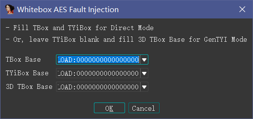
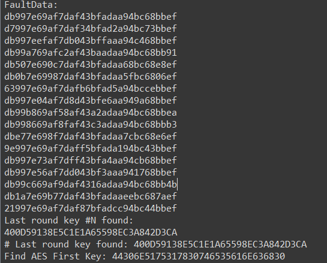

# WhiteBox AES 故障注入插件 for IDA Pro

此插件可在 IDA Pro 中直接对 Whitebox AES 实现进行故障注入和密钥恢复分析，支持两种模式：

* **直接模式（Direct Mode）**：加载已有的 TBox 和 TYiBox 表，并在指定字节位置注入故障。
* **表生成模式（GenTYI Mode）**：从 3D TBox 基址推导生成 TYiBox 表，然后进行故障注入。

## 功能特性

* 自动生成并注入故障的 AES 加密轨迹。
* 支持直接输入表格和即时生成 TYiBox 两种方式。

## 前提条件

1. **IDA Pro**：已在 IDA Pro 7.7 及以上版本测试通过。

## 安装

1. 将插件文件 `WhiteBoxAesCrack.py` 与 `WBmodule` 复制到 IDA 的插件目录，例如：

   ```bash
   cp WhiteBoxAesCrack.py ~/.idapro/plugins/
   cp -r WBModule ~/.idapro/plugins/
   ```

2. 重启 IDA Pro 

3. 在 IDA 输出窗口确认插件已初始化：

   

## 使用方法

1. 在 IDA 中打开包含 Whitebox AES 实现的二进制文件。

2. 按 `Ctrl+Shift+W` 快捷键，或通过菜单 **Edit → Plugins → WhiteBoxAesCrack** 调用插件。

3. 在弹出的表单中填写：

   * **TBox Base**：16×256 字节 TBox 表的基址（仅限直接模式）。

   * **TYiBox Base**：9×16×256×4 字节 TYiBox 表的基址（仅限直接模式）。

   * **3D TBox Base**：10×16×256 字节 3D TBox 表的基址（仅限表生成模式）。

     

4. 若使用表生成模式，仅填写 **3D TBox Base** 并留空 **TYiBox Base**；若使用直接模式，则同时填写 **TBox Base** 和 **TYiBox Base**。

5. 点击 **OK**：

   * 插件会从指定地址读取表数据。
   * 生成一条无故障轨迹以及 16 条按字节注入故障的轨迹。
   * 在 IDA 输出窗口打印每条轨迹的十六进制字符串。
   * 调用 DFA 分析，恢复最后一轮密钥并打印结果。
   * 调用进行AESKeySchedule恢复第一轮密钥也就是初始密钥

## 示例输出

```text
[*] Using GenTYI Mode from 3D TBox
FaultData:
33e1a6...  # 基线轨迹
...
# Last round key found: XXXXX
Find AES First Key: XXXXX
```



## 故障排查

* **表读取失败**：若出现 `Failed to read TBox at 0x...`，请检查地址是否正确以及模块是否已加载。
* **模块导入错误**：确保 `WBModule` 与插件同目录，且 `sys.path` 已包含该路径。

